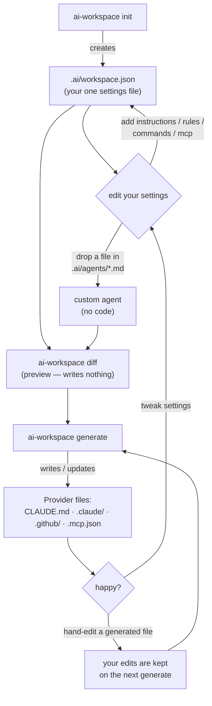

# ai-workspace

Write your AI coding settings **once**, and generate the specific files that each AI
tool (Claude Code, Cursor, Copilot, …) expects.

> **Analogy:** you write one recipe, and this tool prints it in English, Spanish, and
> French. You maintain one source; every AI tool gets its own copy in its own format.

This is an early **learning-stage** project. It supports **two** AI tools (Claude Code
and GitHub Copilot) end-to-end. See [Status](#status) for what's done.

---

## Try it in 30 seconds

```bash
npm install                       # one time

# make a scratch folder to play in, so we don't touch your real project
mkdir /tmp/playground

# 1. create the single settings file
npm run ai-workspace -- init --cwd /tmp/playground

# 2. generate the real AI files from it
npm run ai-workspace -- generate --cwd /tmp/playground

# look at what got created:
cat /tmp/playground/CLAUDE.md
cat /tmp/playground/.claude/agents/architect.md
```

Run `generate` a second time — nothing changes (that's on purpose). Now hand-edit
`CLAUDE.md`, run `generate` again, and your edit is **kept**, not overwritten.

> `npm run ai-workspace -- <command>` is the **contributor** way (running from a clone of
> this repo). Your team doesn't do that — see below.

---

## For your team (internal install)

Teammates don't clone this repo. They add it as a dev dependency of **their own** project,
straight from your Git host:

```bash
npm install -D github:YOUR_ORG/ai-workspace       # once, in each project
```

npm builds it automatically on install (the `prepare` step) and exposes an
`ai-workspace` command inside that project. Add a script so nobody types anything fancy:

```jsonc
// that project's package.json
"scripts": { "ai:sync": "ai-workspace generate" }
```

Now every teammate **and CI** runs the identical version:

```bash
npm run ai:sync           # or:  npx ai-workspace generate
```

Why this is the easiest for a team:
- **Zero manual setup** — it arrives with the `npm install` everyone already runs.
- **Same version for all** — pinned in `package.json` + lockfile, so no drift.
- **Works in CI** — no global installs, no `tsx`, no path knowledge.
- **Upgrade the whole team** by bumping the Git ref (tag/commit) and re-installing.

**Under the hood:** `npm run build` bundles the entire CLI into one self-contained
`dist/index.js` (~890 KB) that needs nothing but Node — no `tsx`, no runtime
`node_modules`. That single file is what ships. (When you're ready to go public,
the same build is what you'd `npm publish` for `npx ai-workspace`.)

---

## The three ideas (that's all it is)

### 1. One settings file — `.ai/workspace.json`
This is the **only** file you edit by hand. It lists which AI tools you use and what
you want them to know. Everything else is generated from it.

```json
{
  "version": 1,
  "providers": ["claude"],
  "agents": ["architect"],
  "instructions": [
    { "id": "coding-style", "title": "Coding Style", "body": "Prefer small functions." }
  ]
}
```

### 2. Adapters — one per AI tool
Each AI tool stores its settings differently (Claude uses `CLAUDE.md`, Cursor uses
`.cursor/rules/`, etc.). An **adapter** is a small piece of code that knows how to write
files for *one* tool. To support a new tool later, you write a new adapter — you don't
touch anything else. Today there's one: [`claude.ts`](packages/core/src/providers/claude.ts).

### 3. The lockfile — how we avoid erasing your edits
When the tool generates a file, it remembers what it wrote (in `.ai/workspace-lock.json`).
Next time you run `generate`, it compares three things:
- what it wrote last time,
- what's on disk now (maybe you edited it),
- what it wants to write now.

From that it decides: create / skip / update / **keep your edit** / warn about a clash.
This is the part that makes it safe to re-run. You don't need to understand the details
to use it — just know your edits are safe.

---

## Add your own custom agent (no code!)

Drop a markdown file in `.ai/agents/`. The filename is the agent's id; the top part
(between the `---` lines) is its settings; the rest is its instructions.

`.ai/agents/security-reviewer.md`:
```md
---
name: Security Reviewer
description: Reviews code for security vulnerabilities
model: reasoning
tools: read, grep
---
You are a meticulous security reviewer. Flag injection, authz, and secret-handling bugs.
```

Run `generate` — that's it. The agent appears in `.claude/agents/`. No TypeScript, no
manifest entry. (Drop a file with the same name as a built-in agent to override it.)

---

## Where things live

This is a **monorepo**: two linked packages under `packages/`. They refer to each other
by name (`@ai-workspace/core`), just like published npm packages — not by messy file paths.

```
packages/
  core/                        ← the "brain": pure logic, never touches files
    package.json               ← declares the package name @ai-workspace/core
    src/index.ts               ← the "front door" — the only thing other code imports
    src/domain/schema/         ← the shapes of our data (what valid settings look like)
    src/resolve.ts             ← settings -> a full, concrete plan (+ custom agents)
    src/merge.ts               ← the "keep your edits" decision logic
    src/regions.ts             ← merges files that mix generated + hand-written text
    src/structured.ts          ← merges JSON files (.mcp.json) by key
    src/providers/             ← one adapter per AI tool: claude.ts, copilot.ts

  cli/                         ← the "hands": commands + all file/terminal I/O
    package.json               ← @ai-workspace/cli; depends on @ai-workspace/core
    src/commands/              ← init, generate
    src/infra/fs-shell.ts      ← the ONLY file that touches your disk
    src/infra/agents-loader.ts ← reads your .ai/agents/*.md files
    src/pipeline.ts            ← glues brain + hands together
    src/index.ts               ← the entry point (defines the commands)

docs/design/                   ← why things are built this way (deeper reading, optional)
```

**Two rules we follow:**
1. `core/` never reads or writes files — all I/O is in `cli/`. This makes the tricky
   logic easy to test without a real filesystem.
2. Other code imports from `@ai-workspace/core` (the front door), never from deep paths.
   The package's insides can move without breaking anything.

---

## The libraries we use (and why)

We build on small, popular, standard libraries — not a big framework:

| Library | What it does for us |
|---|---|
| [`cac`](https://github.com/cacjs/cac) | parses commands like `generate --cwd x` |
| [`zod`](https://zod.dev) | checks the settings file is valid, with friendly errors |
| [`@clack/prompts`](https://github.com/bombshell-dev/clack) | the interactive question flow in `init` |
| [`picocolors`](https://github.com/alexeyraspopov/picocolors) | colors the terminal output |
| [`yaml`](https://eemeli.org/yaml/) | reads the `---` settings block at the top of custom agent files |
| [`tsx`](https://github.com/privatenumber/tsx) | runs our TypeScript directly (no build step while learning) |
| [`vitest`](https://vitest.dev) | runs the tests |

---

## Shared catalog (team distribution)

Beyond editing your own settings, a team can **share** agents, rules, prompts, and MCP
servers through a **catalog** — a Git repo the team curates. Point your workspace at it:

```jsonc
// .ai/workspace.json
"registry": { "url": "git@github.com:YOUR_ORG/ai-registry.git", "ref": "main" },
"use": ["agent:security-reviewer", "pack:frontend-team"]
```

The catalog repo is just folders of files:

```
ai-registry/
  agents/security-reviewer.md    # same format as .ai/agents/
  rules/tailwind.md
  prompts/pr-review.md
  mcp/postgres.json
  packs/frontend-team.yaml        # a curated bundle: a list of refs
```

Two ways to consume it — **à la carte** or **by the pack**:

```bash
ai-workspace search react            # browse the catalog
ai-workspace add agent:security-reviewer   # pick one artifact
ai-workspace add pack:frontend-team        # or a whole curated bundle
ai-workspace generate                # project everything into your AI tools
```

- **Packs** bundle multiple artifacts; **dependencies** pull in what an artifact needs
  (adding `react-expert` auto-adds its `tailwind` rule).
- `add`/`remove` just edit the `use` list; `generate` applies it and `remove` + `generate`
  cleanly deletes exactly what a pack created (your own edits stay).
- The catalog is fetched into `.ai/cache/registry/` (gitignore that in your project).

## The complete end-user flow



The loop is: **edit settings → `diff` to preview → `generate` → repeat.** Re-running is
always safe — it never clobbers your hand edits (see [The three ideas](#the-three-ideas-thats-all-it-is)).

## Command reference

| Command | What it does | Exit code |
|---|---|---|
| `init` | Interactively create `.ai/workspace.json` (asks name + which AI tools). | 0 |
| `generate` | Read the settings and write/update the provider files. | 0, or **1** if there's a conflict |
| `diff` | Show what `generate` *would* change — writes nothing. | 0, or 1 if a conflict would occur |
| `search [query]` | Search the shared catalog for artifacts and packs. | 0 |
| `add <ref…>` | Add catalog refs (e.g. `agent:x`, `pack:y`) to this workspace. | 0 |
| `remove <ref…>` | Remove catalog refs (files cleaned up on next `generate`). | 0 |
| `list` | Show what's installed and what the catalog offers. | 0 |

### Options

| Option | Works on | Meaning |
|---|---|---|
| `--cwd <folder>` | all | Run against `<folder>` instead of the current directory. |
| `--yes` | `init` | Skip the questions, use sensible defaults (for scripts/CI). |
| `--help` | all | Show usage. |
| `--version` | all | Print the version. |

### What each result word means

When `generate`/`diff` lists a file, the word tells you what happened:

| Word | Meaning |
|---|---|
| `create` | new file, didn't exist before |
| `update` | you hadn't touched it; safely rewritten |
| `keep` | **you edited it** and settings didn't change → your version kept |
| `noop` | nothing to do (already correct) |
| `restore` | you deleted it but settings still want it → recreated |
| `conflict` | you *and* the settings changed the same spot → **left alone, you decide** |
| `orphan-remove` | you removed it from settings → cleanly deleted |
| `orphan-keep` | removed from settings but you'd edited it → left in place |

Below the file list, **notices** warn about anything a tool can't fully represent (e.g.
"Copilot has no agents") — never a silent drop.

### For contributors (working on the tool itself)

```bash
npm install          # install deps
npm test             # run the test suite (vitest)
npm run typecheck    # type-check everything
npm run build        # bundle to dist/index.js
```

## Documentation

- [docs/design/architecture.md](docs/design/architecture.md) — diagrams of how it fits together
- [docs/design/merge-engine.md](docs/design/merge-engine.md) — why re-running never eats your edits
- [docs/design/provider-capability-matrix.md](docs/design/provider-capability-matrix.md) — what each AI tool can/can't represent

---

## Status

Done — **two providers, fully:**
- **Claude Code**: `CLAUDE.md` (instructions + rules), `.claude/agents/*.md`,
  `.claude/commands/*.md`, and `.mcp.json`.
- **GitHub Copilot**: `.github/copilot-instructions.md`, `.github/instructions/*.md`
  (with `applyTo` globs), and `.github/prompts/*.md`.
- Safely re-runnable (idempotent): running twice changes nothing.
- **Keeps your edits** — prose you add around generated blocks, and keys you add to
  `.mcp.json`, both survive re-generation.
- **Honest about limits** — when a tool can't represent something (Copilot has no
  agents), it warns you instead of silently dropping it.
- **Clean uninstall** — remove a tool or a rule from your settings, and exactly the
  files/blocks it created are removed; your own content stays.

Not done yet (on purpose — kept focused):
- The other three AI tools (Cursor, Gemini, Codex).
- Downloading agents/skills from a shared registry (they're hard-coded for now).
- Auto-merging when both you *and* the tool changed the *same lines* (today that's
  flagged as a conflict for you to resolve).

See [`docs/design/`](docs/design/) if you want the deeper reasoning behind the design.
