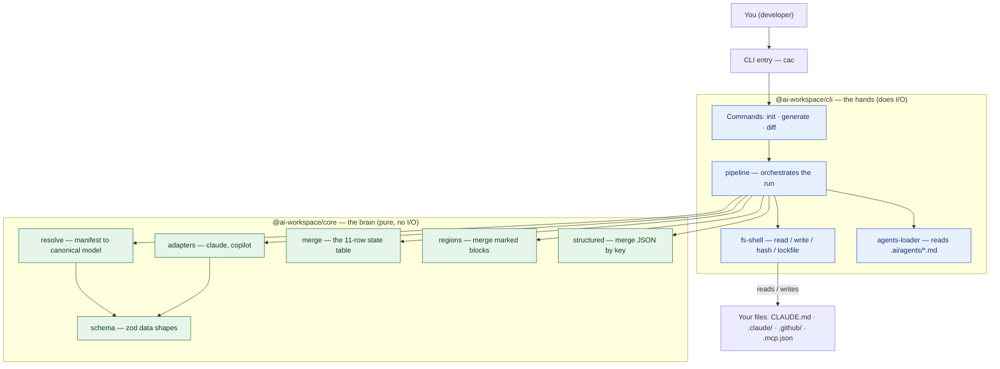
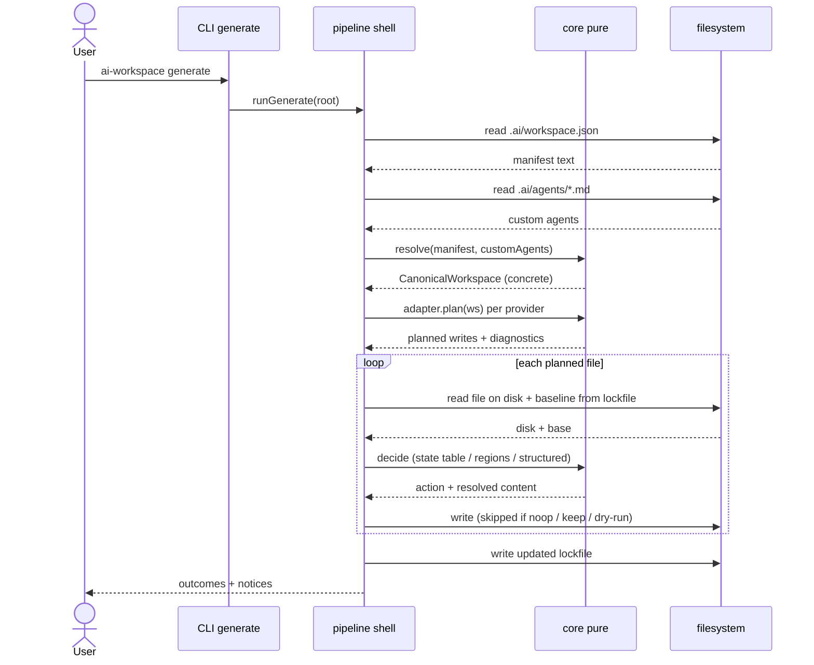
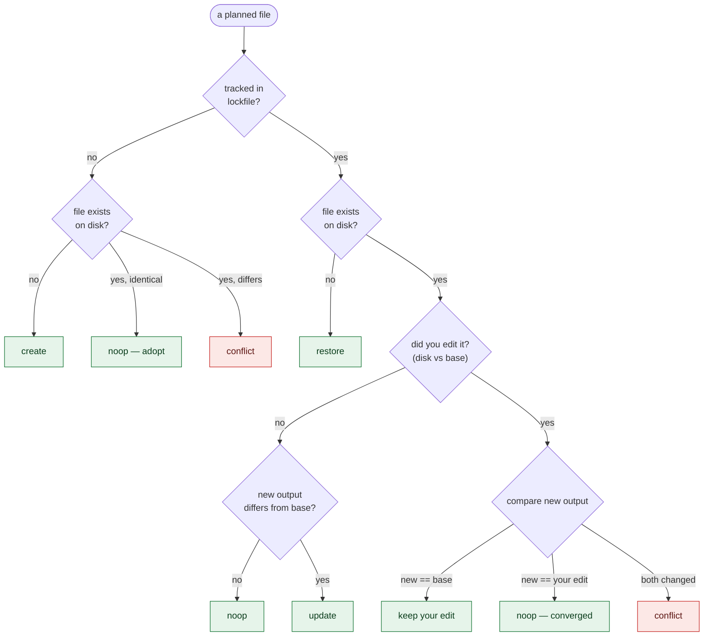
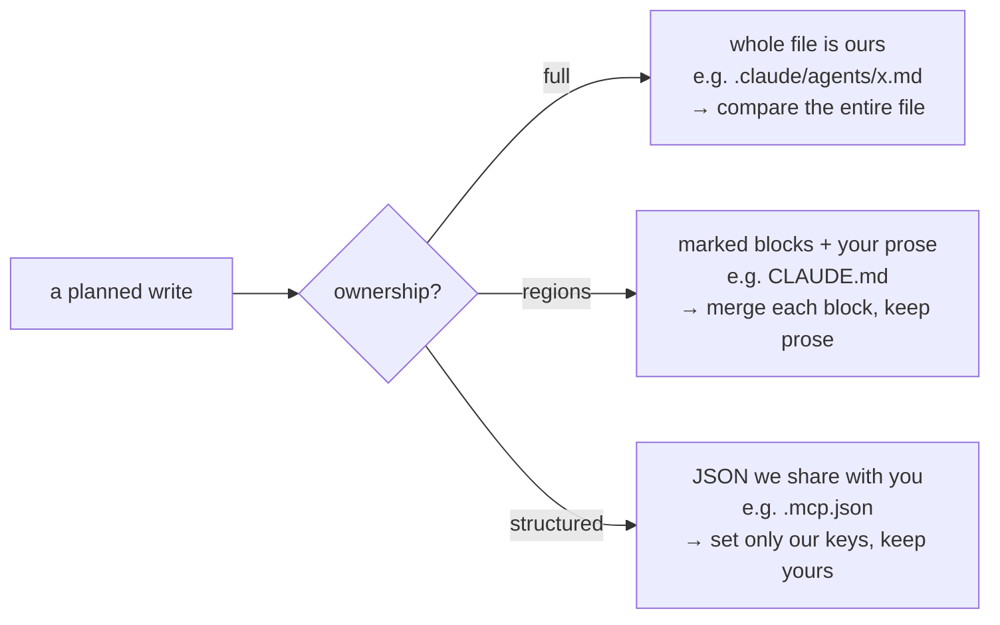
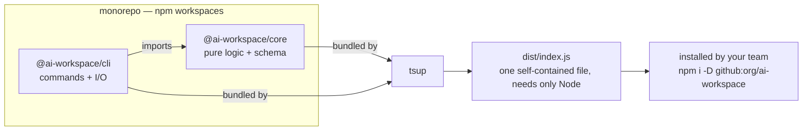
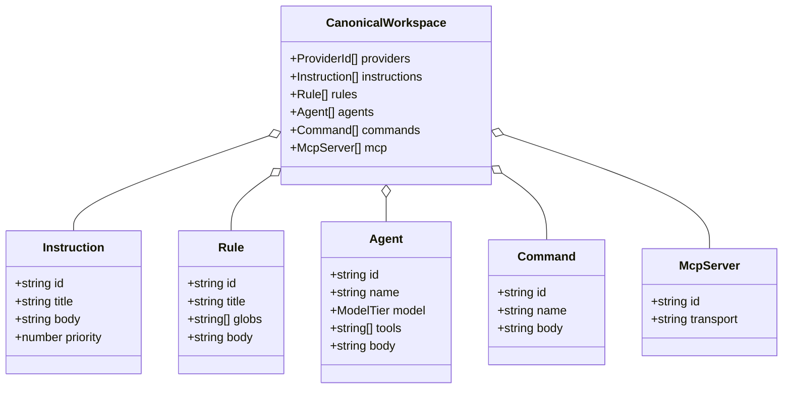
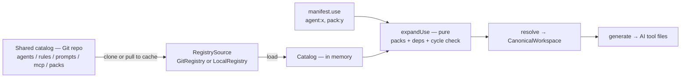

# Architecture

How `ai-workspace` is put together, in diagrams. For the *why* behind the two hardest
parts, see [merge-engine.md](./merge-engine.md) and
[provider-capability-matrix.md](./provider-capability-matrix.md).

The whole system has one job: keep **one** settings file (`.ai/workspace.json`) as the
source of truth, and project it into the specific files each AI tool expects — safely,
every time.

---

## 1. The big picture

Two packages. `core` is the **brain** (pure logic, never touches the disk). `cli` is the
**hands** (commands + all file I/O). The brain is easy to test because it's just
input → output; all the messy real-world stuff is quarantined in the hands.

**The one rule that holds it together:** arrows only ever point *from* `cli` *into*
`core`, never the other way. The brain doesn't know the hands exist.

---

## 2. What happens when you run `generate`

Follow one command end to end. Notice the shape: the shell *reads*, asks the pure core to
*decide*, then the shell *writes*.

`diff` is the *exact same* sequence with the writes turned off — that's why what `diff`
shows always matches what `generate` does.

---

## 3. The merge decision (why your edits survive)

For every file, the engine compares three things — **base** (what it wrote last time),
**disk** (what's there now), **new** (what it wants now) — and picks an action. This is
the safety mechanism in one picture:

**Green = it acts safely. Red = it stops and asks you** (never overwrites your work).
Files that were tracked but are no longer wanted follow a parallel path: `orphan-remove`
if you never touched them, `orphan-keep` if you did.

---

## 4. Three kinds of file, three merge strategies

One state table, but a "unit" means something different per file type — because you can't
merge a Markdown file the way you merge JSON.

---

## 5. How the packages fit together

During development you run the TypeScript directly with `tsx`. To ship, `tsup` bundles
both packages (and every dependency) into a single `dist/index.js` a teammate can run with
nothing but Node. See the README's "For your team" section.

---

## 6. The canonical data model

This is the shape `resolve()` produces and every adapter consumes. It's the *union* of
what all providers can express; each adapter projects the parts its target supports.

Each item also carries **provenance** (did it come from the manifest, a registry artifact,
or a `.ai/agents/*.md` file?) so `diff` and clean-uninstall can trace every generated line
back to its source.

---

## 7. The distribution layer (shared catalog)

The team curates a **catalog** (a Git repo of artifact files + packs). A project selects
from it via `manifest.use`; `expandUse` unfolds packs and pulls dependencies; the result
feeds the same `resolve → generate` pipeline as everything else.

The `RegistrySource` port is the seam: `GitRegistry` (clone/pull to `.ai/cache/registry/`)
and `LocalRegistry` (read a folder) implement it today; an HTTP or private-registry
backend would be a third implementation with no other changes. `add`/`remove` simply edit
`manifest.use`; the merge engine's orphan logic makes `remove` a precise, clean uninstall.

## Design principles at a glance

| Principle | Where it shows up |
|---|---|
| Functional core / imperative shell | `core` is pure; all I/O lives in `cli` |
| Ports & adapters | `ProviderAdapter` is the port; `claude.ts` / `copilot.ts` are adapters |
| Single responsibility | one concern per file (`merge`, `regions`, `structured`, `resolve`) |
| One source of truth | `.ai/workspace.json` drives everything; the rest is generated |
| Deterministic output | stable ordering + idempotent regeneration (state-table row 5) |
| Fail loud, never silent | lossy/unsupported projections emit diagnostics; conflicts stop the run |
